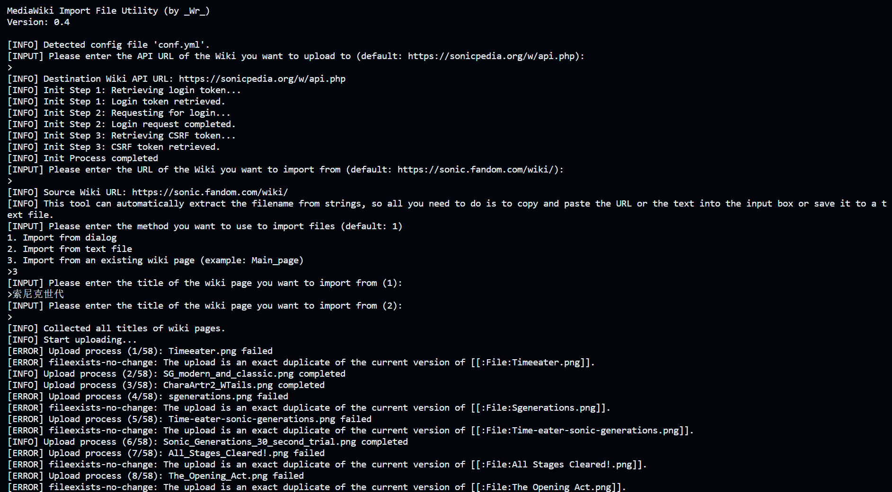

# MediaWiki File Import Utility 
[](https://github.com/AlanYe-Dev/mediawiki-file-import-utility/actions/workflows/pyinstaller-windows.yml)

A utility which can easily import file from another wiki.



## Requirements

- Destination Wiki API URL (Example: https://example.com/w/api.php)
- Import Source Wiki Main URL (Example: https://example.com/wiki/)
- A list of import filename

Also, this requires ```$wgAllowCopyUploads = true;``` in the wiki's local settings and an account with the ```upload_by_url``` user right. 

## Usage

### Fetch a bot password

1. Turn to **Special:BotPasswords** on the Destination Wiki
2. Fill in your username/passwords
3. Create a new bot
4. Remember to add upload permissions
5. Save the bot passwords, it should be like ```xxx@xxx``` and a random key.

optional: You can save your credentials to 1Password, and fill in ```conf.yml``` with secret reference URIs (op://).

### Windows

1. Download the latest build version from [here](https://github.com/AlanYe-Dev/mediawiki-file-import-utility/actions/workflows/pyinstaller-windows.yml).
2. Decompress the file, creat a new directory (folder), and move ```main.exe```.
3. Run the ```main.exe``` for the first time, and it'll create the file  ```conf.yml.example```.
4. Rename ```conf.yml.example``` to ```conf.yml```.
5. Fill in the Bot credentials previous fetched. Example:
```
bot:
  username: xxx@xxx
  password: 7aCTEJJM6eitNpJqmfsaPfERZmsQcawh
```

6. Run ```main.exe``` and follow the instructions.

### Other systems
Sorry, but there's currently no other systems' version of this utility. Please turn to the [development section](#development).

## Development
### Local
1. Prepare Python 3.10 + environment.
2. Clone this repository. ```git clone https://github.com/AlanYe-Dev/mediawiki-file-import-utility.git```.
3. cd into the directory ```cd mediawiki-file-import-utility```.
4. Install requirements ```pip install -r src/requirements.txt```.
5. Duplicate ```conf.yml.example```, rename it to ```conf.yml```.
6. Fill in the Bot credentials previous fetched.
7. Optional: Prepare a list of import filename to ```import.txt```.
8. run ```python3 src/main.py```

#### Build
Use PyInstaller to complete the build process. ```pyinstaller -F src/main.py```

### Online
1. Fork this repository, including the GitHub Actions
2. Edit ```src/main.py``` or whatever you like, and the Actions will build your code everytime you edit it.


### Issues & Pull requests
Please feel free to create new issues and pull requests in this repository!